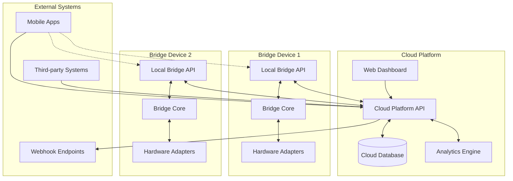
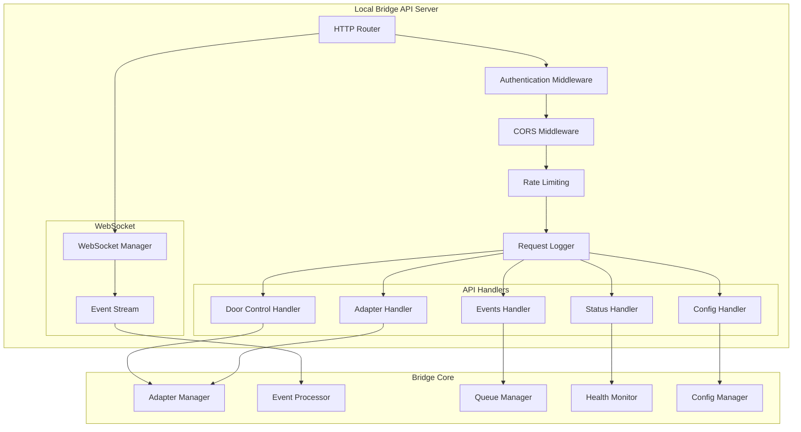

# Design Document

## Overview

The Bridge API System provides comprehensive REST and WebSocket APIs for interacting with gym door bridge devices. The system consists of two main components:

1. **Local Bridge API** - HTTP endpoints running on each bridge device for direct control and monitoring
2. **Cloud Platform API** - Centralized server-side APIs for managing multiple bridges, users, and analytics

The design leverages the existing bridge architecture, extending the current health monitoring and webhook capabilities to provide a full-featured API system.

## Architecture

### High-Level Architecture



### Local Bridge API Architecture



## Components and Interfaces

### Local Bridge API Components

#### 1. HTTP Server
- **Purpose**: Serves REST API endpoints for bridge control and monitoring
- **Technology**: Go net/http with gorilla/mux router
- **Port**: Configurable (default 8081)
- **Security**: HTTPS with TLS certificates, HMAC authentication

#### 2. WebSocket Server
- **Purpose**: Real-time event streaming and bidirectional communication
- **Technology**: gorilla/websocket
- **Features**: Event filtering, connection management, heartbeat

#### 3. Authentication Middleware
- **Methods**: 
  - HMAC-SHA256 signatures (for cloud platform)
  - API keys (for local access)
  - JWT tokens (for user sessions)
- **Features**: Rate limiting, IP allowlisting, audit logging

#### 4. API Handlers
- **Door Control**: Unlock/lock operations with duration control
- **Status**: Health monitoring, adapter status, system metrics
- **Configuration**: Device settings, adapter configuration
- **Events**: Historical event queries with pagination
- **Adapters**: Adapter management and control

### Cloud Platform API Components

#### 1. Device Management Service
- **Purpose**: Manage bridge device registration, pairing, and configuration
- **Database**: PostgreSQL with device registry, configuration, and status tables
- **Features**: Device grouping, bulk operations, configuration templates

#### 2. Event Ingestion Service
- **Purpose**: Receive and process events from bridge devices
- **Technology**: High-throughput message queue (Redis/RabbitMQ)
- **Features**: Event validation, deduplication, batch processing

#### 3. User Management Service
- **Purpose**: Manage gym members, access permissions, and authentication
- **Features**: Role-based access control, group management, external ID mapping

#### 4. Analytics Service
- **Purpose**: Generate reports and insights from access data
- **Technology**: Time-series database (InfluxDB) for metrics
- **Features**: Real-time dashboards, scheduled reports, anomaly detection

#### 5. Notification Service
- **Purpose**: Send alerts and notifications via multiple channels
- **Channels**: Email, SMS, push notifications, webhooks
- **Features**: Template management, delivery tracking, retry logic

## Data Models

### Local Bridge API Models

```go
// Door Control Request
type DoorUnlockRequest struct {
    DurationMs int    `json:"durationMs" validate:"min=1000,max=30000"`
    Reason     string `json:"reason,omitempty"`
    RequestedBy string `json:"requestedBy,omitempty"`
}

// Device Status Response
type DeviceStatusResponse struct {
    DeviceID      string                `json:"deviceId"`
    Status        string                `json:"status"`
    Timestamp     time.Time             `json:"timestamp"`
    Uptime        time.Duration         `json:"uptime"`
    Version       string                `json:"version"`
    QueueDepth    int                   `json:"queueDepth"`
    AdapterStatus []types.AdapterStatus `json:"adapterStatus"`
    Resources     tier.SystemResources  `json:"resources"`
    Tier          tier.Tier             `json:"tier"`
    LastEventTime *time.Time            `json:"lastEventTime,omitempty"`
}

// Configuration Update Request
type ConfigUpdateRequest struct {
    EnabledAdapters   []string                      `json:"enabledAdapters,omitempty"`
    AdapterConfigs    map[string]interface{}        `json:"adapterConfigs,omitempty"`
    HeartbeatInterval int                           `json:"heartbeatInterval,omitempty"`
    QueueMaxSize      int                           `json:"queueMaxSize,omitempty"`
    UnlockDuration    int                           `json:"unlockDuration,omitempty"`
}

// Event Query Request
type EventQueryRequest struct {
    StartTime    *time.Time `json:"startTime,omitempty"`
    EndTime      *time.Time `json:"endTime,omitempty"`
    EventType    string     `json:"eventType,omitempty"`
    UserID       string     `json:"userId,omitempty"`
    Limit        int        `json:"limit,omitempty" validate:"max=1000"`
    Offset       int        `json:"offset,omitempty"`
}

// WebSocket Message
type WebSocketMessage struct {
    Type      string      `json:"type"`
    Timestamp time.Time   `json:"timestamp"`
    Data      interface{} `json:"data"`
}
```

### Cloud Platform API Models

```go
// Device Registration
type DeviceRegistration struct {
    DeviceID     string            `json:"deviceId"`
    PairCode     string            `json:"pairCode"`
    DeviceName   string            `json:"deviceName"`
    Location     string            `json:"location"`
    Hostname     string            `json:"hostname"`
    Platform     string            `json:"platform"`
    Version      string            `json:"version"`
    Tier         string            `json:"tier"`
    Metadata     map[string]string `json:"metadata,omitempty"`
}

// User Management
type User struct {
    ID           string            `json:"id"`
    ExternalID   string            `json:"externalId"`
    Name         string            `json:"name"`
    Email        string            `json:"email"`
    Phone        string            `json:"phone,omitempty"`
    Status       string            `json:"status"`
    Permissions  []Permission      `json:"permissions"`
    Groups       []string          `json:"groups"`
    Metadata     map[string]string `json:"metadata,omitempty"`
    CreatedAt    time.Time         `json:"createdAt"`
    UpdatedAt    time.Time         `json:"updatedAt"`
}

// Access Permission
type Permission struct {
    DeviceID    string     `json:"deviceId"`
    AccessType  string     `json:"accessType"`
    TimeSlots   []TimeSlot `json:"timeSlots,omitempty"`
    ValidFrom   *time.Time `json:"validFrom,omitempty"`
    ValidUntil  *time.Time `json:"validUntil,omitempty"`
}

// Analytics Query
type AnalyticsQuery struct {
    DeviceIDs   []string   `json:"deviceIds,omitempty"`
    UserIDs     []string   `json:"userIds,omitempty"`
    StartTime   time.Time  `json:"startTime"`
    EndTime     time.Time  `json:"endTime"`
    Granularity string     `json:"granularity"`
    Metrics     []string   `json:"metrics"`
    GroupBy     []string   `json:"groupBy,omitempty"`
}
```

## Error Handling

### Error Response Format
```go
type ErrorResponse struct {
    Error     string            `json:"error"`
    Code      string            `json:"code"`
    Message   string            `json:"message"`
    Details   map[string]string `json:"details,omitempty"`
    Timestamp time.Time         `json:"timestamp"`
    RequestID string            `json:"requestId"`
}
```

### Error Categories
- **Authentication Errors** (401): Invalid credentials, expired tokens
- **Authorization Errors** (403): Insufficient permissions
- **Validation Errors** (400): Invalid request format, missing fields
- **Not Found Errors** (404): Resource not found
- **Conflict Errors** (409): Resource already exists, state conflicts
- **Rate Limit Errors** (429): Too many requests
- **Server Errors** (500): Internal server errors, service unavailable

### Circuit Breaker Pattern
- Implement circuit breakers for external service calls
- Graceful degradation when dependencies are unavailable
- Health check endpoints for monitoring circuit breaker status

## Testing Strategy

### Unit Testing
- **API Handlers**: Test request/response handling, validation, error cases
- **Authentication**: Test various auth methods, token validation, rate limiting
- **WebSocket**: Test connection management, message broadcasting, filtering
- **Data Models**: Test serialization, validation, business logic

### Integration Testing
- **End-to-End API Flows**: Test complete request flows from client to bridge core
- **Database Integration**: Test data persistence, queries, migrations
- **External Service Integration**: Test cloud API communication, webhook delivery
- **WebSocket Integration**: Test real-time event streaming, connection handling

### Load Testing
- **API Endpoints**: Test throughput, response times under load
- **WebSocket Connections**: Test concurrent connection limits
- **Database Performance**: Test query performance with large datasets
- **Rate Limiting**: Test rate limit enforcement and recovery

### Security Testing
- **Authentication Bypass**: Test auth middleware security
- **Input Validation**: Test injection attacks, malformed requests
- **Rate Limiting**: Test DoS protection, abuse prevention
- **HTTPS/TLS**: Test certificate validation, secure communication

## API Endpoints Specification

### Local Bridge API Endpoints

#### Door Control
- `POST /api/v1/door/unlock` - Unlock door with duration
- `POST /api/v1/door/lock` - Lock door immediately
- `GET /api/v1/door/status` - Get door lock status

#### Device Status
- `GET /api/v1/status` - Get comprehensive device status
- `GET /api/v1/health` - Get health check status (existing)
- `GET /api/v1/metrics` - Get performance metrics

#### Configuration
- `GET /api/v1/config` - Get current configuration
- `PUT /api/v1/config` - Update configuration
- `POST /api/v1/config/reload` - Reload configuration from file

#### Events
- `GET /api/v1/events` - Query historical events
- `GET /api/v1/events/stats` - Get event statistics
- `DELETE /api/v1/events` - Clear event history (admin only)

#### Adapters
- `GET /api/v1/adapters` - List all adapters and status
- `GET /api/v1/adapters/{name}` - Get specific adapter status
- `POST /api/v1/adapters/{name}/enable` - Enable adapter
- `POST /api/v1/adapters/{name}/disable` - Disable adapter
- `PUT /api/v1/adapters/{name}/config` - Update adapter configuration

#### WebSocket
- `GET /api/v1/ws` - WebSocket endpoint for real-time events

### Cloud Platform API Endpoints

#### Device Management
- `POST /api/v1/devices/pair` - Pair new device (existing)
- `GET /api/v1/devices` - List managed devices
- `GET /api/v1/devices/{deviceId}` - Get device details
- `PUT /api/v1/devices/{deviceId}` - Update device configuration
- `DELETE /api/v1/devices/{deviceId}` - Remove device
- `POST /api/v1/devices/{deviceId}/heartbeat` - Device heartbeat (existing)

#### Event Ingestion
- `POST /api/v1/checkin` - Submit check-in events (existing)
- `POST /api/v1/events/batch` - Submit events in batch
- `GET /api/v1/events` - Query events across devices

#### User Management
- `GET /api/v1/users` - List users with pagination
- `POST /api/v1/users` - Create new user
- `GET /api/v1/users/{userId}` - Get user details
- `PUT /api/v1/users/{userId}` - Update user
- `DELETE /api/v1/users/{userId}` - Delete user
- `POST /api/v1/users/batch` - Bulk user operations

#### Access Control
- `GET /api/v1/permissions` - List permissions
- `POST /api/v1/permissions` - Grant permission
- `DELETE /api/v1/permissions/{permissionId}` - Revoke permission
- `GET /api/v1/users/{userId}/permissions` - Get user permissions
- `PUT /api/v1/users/{userId}/permissions` - Update user permissions

#### Analytics
- `GET /api/v1/analytics/usage` - Usage analytics
- `GET /api/v1/analytics/devices` - Device performance analytics
- `GET /api/v1/analytics/users` - User activity analytics
- `POST /api/v1/analytics/reports` - Generate custom reports

#### Notifications
- `GET /api/v1/notifications` - List notification templates
- `POST /api/v1/notifications` - Send notification
- `GET /api/v1/webhooks` - List webhook configurations
- `POST /api/v1/webhooks` - Create webhook
- `PUT /api/v1/webhooks/{webhookId}` - Update webhook
- `DELETE /api/v1/webhooks/{webhookId}` - Delete webhook

## Security Considerations

### Authentication Methods
1. **HMAC Authentication**: For bridge-to-cloud communication
2. **API Keys**: For programmatic access with scoped permissions
3. **JWT Tokens**: For user session management
4. **mTLS**: For high-security environments

### Authorization Model
- **Role-Based Access Control (RBAC)**: Admin, Manager, Operator, Viewer roles
- **Resource-Based Permissions**: Device-specific and operation-specific permissions
- **Scope-Based API Keys**: Limited permissions for third-party integrations

### Security Headers
- HTTPS enforcement with HSTS
- CORS configuration with origin validation
- Content Security Policy (CSP)
- X-Frame-Options, X-Content-Type-Options

### Rate Limiting
- Per-IP rate limiting with sliding window
- Per-API-key rate limiting with different tiers
- Adaptive rate limiting based on system load
- Rate limit headers in responses

### Audit Logging
- All API requests logged with user context
- Security events (auth failures, permission denials)
- Configuration changes with before/after values
- Data access logging for compliance

## Performance Optimization

### Caching Strategy
- **Redis Cache**: Frequently accessed data (user permissions, device configs)
- **HTTP Caching**: Static responses with appropriate cache headers
- **Database Query Optimization**: Indexes, query optimization, connection pooling

### Pagination and Filtering
- Cursor-based pagination for large datasets
- Field selection to reduce response size
- Efficient filtering with database indexes
- Streaming responses for large exports

### Connection Management
- HTTP/2 support for multiplexing
- Connection pooling for database and external services
- WebSocket connection limits and cleanup
- Graceful connection handling during high load

### Monitoring and Metrics
- Response time monitoring per endpoint
- Error rate tracking and alerting
- Resource utilization monitoring
- Custom business metrics (events/second, active devices)