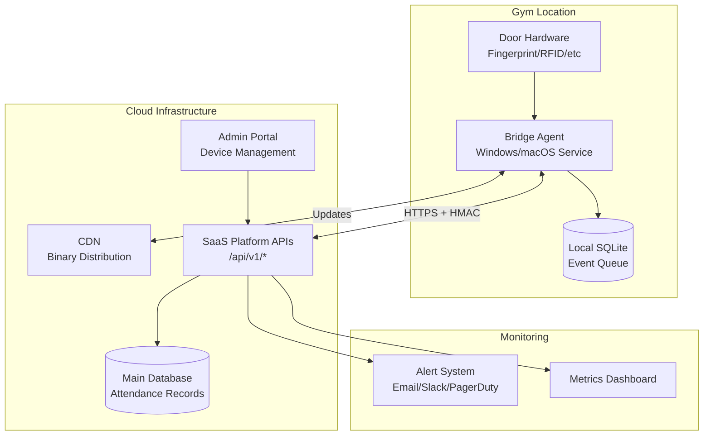
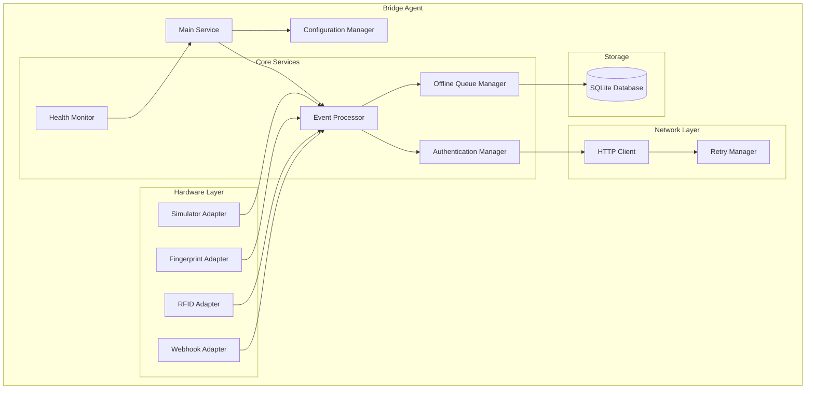
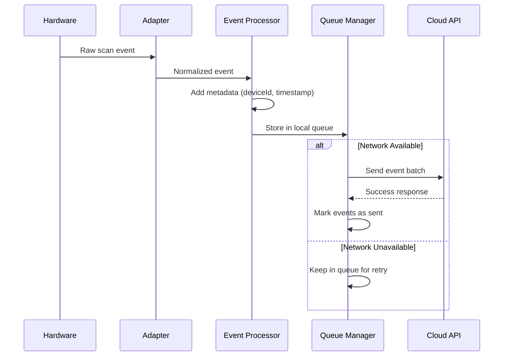

# Design Document

## Overview

The Gym Door Access Bridge is a distributed system consisting of a lightweight local agent (the Bridge) and cloud-based APIs that work together to provide unified door access integration for gyms. The system uses an adapter pattern to support multiple hardware vendors, implements robust offline capabilities, and provides comprehensive monitoring and management features.

### Key Design Principles

- **Hardware Agnostic**: Support any door access hardware through pluggable adapters
- **Resilient**: Operate reliably even with poor network connectivity or hardware failures  
- **Secure**: Use industry-standard authentication and encryption practices
- **Self-Managing**: Automatically adjust performance and handle updates
- **Observable**: Provide comprehensive monitoring and alerting capabilities

## Architecture

### System Components



### Performance Tiers

The bridge automatically detects system capabilities and operates in the appropriate tier:

- **Lite Mode**: <2 CPU cores OR <2GB RAM
  - Basic functionality only
  - Reduced queue size (1,000 events)
  - Longer heartbeat intervals (5 minutes)
  
- **Normal Mode**: 2-4 CPU cores + ≥2GB RAM  
  - Standard functionality
  - Standard queue size (10,000 events)
  - Normal heartbeat intervals (1 minute)
  
- **Full Mode**: >4 CPU cores + ≥8GB RAM
  - Enhanced features (local web UI, detailed metrics)
  - Maximum queue size (50,000 events)
  - Frequent heartbeats (30 seconds)

## Components and Interfaces

### Bridge Agent Architecture



### Hardware Adapter Interface

```typescript
interface HardwareAdapter {
  name: string;
  initialize(config: AdapterConfig): Promise<void>;
  startListening(): Promise<void>;
  stopListening(): Promise<void>;
  unlockDoor(durationMs: number): Promise<void>;
  getStatus(): AdapterStatus;
  onEvent(callback: (event: RawHardwareEvent) => void): void;
}

interface RawHardwareEvent {
  externalUserId: string;
  timestamp: Date;
  eventType: 'entry' | 'exit' | 'denied';
  rawData?: Record<string, any>;
}
```

### Event Processing Pipeline



### Cloud API Endpoints

#### Device Pairing
```
POST /api/v1/devices/pair
Content-Type: application/json

{
  "pairCode": "ABC123",
  "deviceInfo": {
    "hostname": "gym-pc-01",
    "platform": "windows",
    "version": "1.0.0",
    "tier": "normal"
  }
}

Response:
{
  "deviceId": "dev_abc123",
  "deviceKey": "hmac_secret_key",
  "config": {
    "heartbeatInterval": 60,
    "queueMaxSize": 10000,
    "unlockDuration": 3000
  }
}
```

#### Check-in Event Submission
```
POST /api/v1/checkin
Content-Type: application/json
X-Device-ID: dev_abc123
X-Signature: HMAC-SHA256(body + timestamp + deviceId)
X-Timestamp: 1640995200

{
  "events": [
    {
      "eventId": "evt_unique_id",
      "externalUserId": "fp_12345",
      "timestamp": "2024-01-01T10:00:00Z",
      "eventType": "entry",
      "isSimulated": false,
      "deviceId": "dev_abc123"
    }
  ]
}
```

#### Heartbeat
```
POST /api/v1/devices/heartbeat
Content-Type: application/json
X-Device-ID: dev_abc123
X-Signature: HMAC-SHA256(body + timestamp + deviceId)

{
  "status": "healthy",
  "tier": "normal",
  "queueDepth": 0,
  "lastEventTime": "2024-01-01T10:00:00Z",
  "systemInfo": {
    "cpuUsage": 15.2,
    "memoryUsage": 45.8,
    "diskSpace": 85.1
  }
}
```

## Data Models

### Bridge Local Database Schema

```sql
-- Event queue for offline storage
CREATE TABLE event_queue (
    id INTEGER PRIMARY KEY AUTOINCREMENT,
    event_id TEXT UNIQUE NOT NULL,
    external_user_id TEXT NOT NULL,
    timestamp DATETIME NOT NULL,
    event_type TEXT NOT NULL,
    is_simulated BOOLEAN DEFAULT FALSE,
    raw_data TEXT, -- JSON
    created_at DATETIME DEFAULT CURRENT_TIMESTAMP,
    sent_at DATETIME NULL,
    retry_count INTEGER DEFAULT 0
);

-- Device configuration
CREATE TABLE device_config (
    key TEXT PRIMARY KEY,
    value TEXT NOT NULL,
    updated_at DATETIME DEFAULT CURRENT_TIMESTAMP
);

-- Adapter status tracking
CREATE TABLE adapter_status (
    adapter_name TEXT PRIMARY KEY,
    status TEXT NOT NULL, -- 'active', 'error', 'disabled'
    last_event DATETIME,
    error_message TEXT,
    updated_at DATETIME DEFAULT CURRENT_TIMESTAMP
);
```

### Cloud Database Extensions

```sql
-- New table for device management
CREATE TABLE devices (
    id UUID PRIMARY KEY DEFAULT gen_random_uuid(),
    device_id TEXT UNIQUE NOT NULL,
    device_key TEXT NOT NULL,
    gym_id UUID NOT NULL REFERENCES gyms(id),
    hostname TEXT,
    platform TEXT,
    version TEXT,
    tier TEXT,
    status TEXT DEFAULT 'active',
    last_seen DATETIME,
    created_at DATETIME DEFAULT NOW(),
    updated_at DATETIME DEFAULT NOW()
);

-- External user ID mapping
CREATE TABLE external_user_mappings (
    id UUID PRIMARY KEY DEFAULT gen_random_uuid(),
    device_id UUID NOT NULL REFERENCES devices(id),
    external_user_id TEXT NOT NULL,
    user_id UUID NOT NULL REFERENCES users(id),
    created_at DATETIME DEFAULT NOW(),
    UNIQUE(device_id, external_user_id)
);

-- Extend existing attendance table
ALTER TABLE attendance ADD COLUMN device_id UUID REFERENCES devices(id);
ALTER TABLE attendance ADD COLUMN external_user_id TEXT;
ALTER TABLE attendance ADD COLUMN is_simulated BOOLEAN DEFAULT FALSE;
```

## Error Handling

### Bridge Error Handling Strategy

1. **Hardware Communication Errors**
   - Log error details with adapter context
   - Continue operating with other adapters
   - Retry connection with exponential backoff
   - Alert if adapter offline for >5 minutes

2. **Network Connectivity Issues**
   - Queue events locally with encryption
   - Implement exponential backoff for retries
   - Monitor queue depth and alert on thresholds
   - Graceful degradation of non-essential features

3. **Authentication Failures**
   - Log security events with full context
   - Implement automatic key rotation on auth errors
   - Fallback to offline mode if key rotation fails
   - Alert administrators immediately

4. **Resource Constraints**
   - Monitor CPU, memory, and disk usage
   - Automatically downgrade performance tier
   - Implement queue size limits with FIFO eviction
   - Compress and archive old events

### Cloud Error Handling

1. **Invalid Requests**
   - Return detailed error messages with error codes
   - Log invalid requests for security monitoring
   - Implement rate limiting per device
   - Provide troubleshooting guidance in responses

2. **Database Failures**
   - Implement database connection pooling
   - Use read replicas for non-critical operations
   - Queue critical operations for retry
   - Alert on database connectivity issues

## Testing Strategy

### Unit Testing
- **Adapter Testing**: Mock hardware interfaces, test event normalization
- **Queue Manager**: Test offline storage, replay logic, capacity limits
- **Authentication**: Test HMAC generation, key rotation, error handling
- **Event Processing**: Test deduplication, validation, transformation

### Integration Testing
- **End-to-End Flow**: Hardware → Bridge → Cloud → Database
- **Offline Scenarios**: Network disconnection, queue replay, data integrity
- **Security Testing**: HMAC validation, key rotation, unauthorized access
- **Performance Testing**: Load testing with different tier configurations

### System Testing
- **Multi-Platform**: Test on Windows and macOS with different hardware specs
- **Hardware Simulation**: Test all adapter types including simulator mode
- **Failure Recovery**: Test crash recovery, corrupt data handling, network issues
- **Update Process**: Test automatic updates, rollback scenarios

### Pilot Testing Strategy
1. **Phase 1**: Deploy in simulator mode at pilot gym
2. **Phase 2**: Connect to actual hardware with manual verification
3. **Phase 3**: Enable automatic door unlock with monitoring
4. **Phase 4**: Full production deployment with all features

## Security Considerations

### Authentication Flow
1. Admin generates one-time Pair Code in portal
2. Bridge uses Pair Code to register and receive deviceId + deviceKey
3. All subsequent requests use HMAC-SHA256 authentication
4. Keys can be rotated without service interruption
5. Devices can be revoked instantly from admin portal

### Data Protection
- All local data encrypted at rest using AES-256
- Network communication over HTTPS with certificate pinning
- HMAC signatures prevent request tampering
- No biometric data stored locally or transmitted

### Access Control
- Device-level permissions managed through admin portal
- External user mappings scoped to specific devices
- Audit logging for all administrative actions
- Role-based access control for portal users

## Deployment and Distribution

### Binary Distribution
- Single self-contained binaries for Windows and macOS
- Hosted on CDN with manifest.json for version management
- Automatic signature verification for downloaded binaries
- Docker images available for containerized deployments

### Installation Process
```bash
# macOS installation
curl -sSL https://cdn.yourdomain.com/install.sh | bash -s -- --pair-code ABC123

# Windows installation  
iwr https://cdn.yourdomain.com/install.ps1 | iex; Install-Bridge -PairCode ABC123
```

### Update Mechanism
- Bridge checks manifest.json every 24 hours
- Downloads and verifies new versions automatically
- Graceful restart with queue preservation
- Rollback capability if new version fails health checks