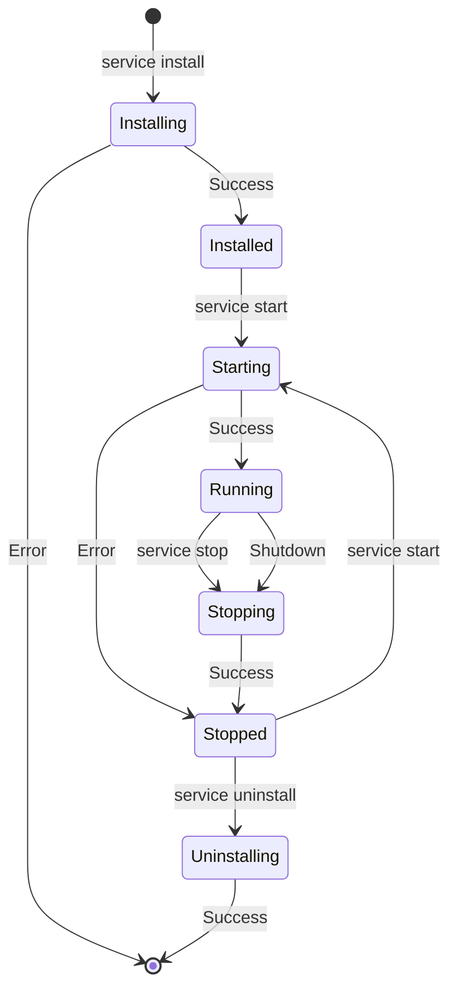

# Windows Service Management

This package provides Windows service management functionality for the Gym Door Bridge application.

## Features

- **Service Installation**: Install the bridge as a Windows service with automatic startup
- **Service Management**: Start, stop, restart, and uninstall the service
- **Service Configuration**: Store and manage service configuration in Windows registry
- **Event Logging**: Integration with Windows Event Log for service events
- **Binary Signing**: Support for Authenticode code signing
- **Service Lifecycle**: Proper handling of service start, stop, and shutdown events

## Usage

### Command Line Interface

The bridge provides several service management commands:

```powershell
# Install the service (requires administrator privileges)
gym-door-bridge.exe service install --config "C:\Bridge\config.yaml" --data-dir "C:\Bridge\data"

# Start the service
gym-door-bridge.exe service start

# Check service status
gym-door-bridge.exe service status

# Stop the service
gym-door-bridge.exe service stop

# Restart the service
gym-door-bridge.exe service restart

# Uninstall the service (requires administrator privileges)
gym-door-bridge.exe service uninstall
```

### Installation Options

The install command supports several configuration options:

- `--config`: Path to the configuration file
- `--log-level`: Log level (debug, info, warn, error)
- `--data-dir`: Directory for service data storage
- `--working-dir`: Service working directory

### Service Configuration

Service configuration is stored in the Windows registry under:
```
HKEY_LOCAL_MACHINE\SYSTEM\CurrentControlSet\Services\GymDoorBridge\Parameters
```

Configuration includes:
- ConfigPath: Path to the application configuration file
- LogLevel: Service logging level
- DataDirectory: Directory for service data
- WorkingDir: Service working directory

## Architecture

### Service Components

1. **Service Wrapper** (`service.go`): Implements the Windows service interface
2. **Service Manager** (`manager.go`): Handles service installation and lifecycle
3. **Configuration** (`config.go`): Manages service configuration in registry
4. **Commands** (`commands.go`): CLI commands for service management
5. **Signing** (`signing.go`): Binary signing support for distribution

### Service Lifecycle



## Requirements

### System Requirements

- Windows 7 or later
- Administrator privileges for installation/uninstallation
- .NET Framework (for event logging)

### Development Requirements

- Go 1.21 or later
- `golang.org/x/sys/windows` package
- Windows SDK (for binary signing)

## Security

### Service Account

The service runs under the LocalSystem account by default, providing:
- Full access to local system resources
- Network access for cloud communication
- Registry access for configuration storage

### Authentication

- Device credentials stored securely using Windows DPAPI
- HMAC-SHA256 authentication for cloud communication
- Event log integration for security monitoring

### Binary Signing

The package supports Authenticode code signing:

```go
config := &SigningConfig{
    CertificatePath: "path/to/certificate.pfx",
    CertPassword:    "certificate_password",
    TimestampURL:    "http://timestamp.digicert.com",
    Description:     "Gym Door Access Bridge",
}

err := SignBinary("gym-door-bridge.exe", config)
```

## Testing

### Unit Tests

Run unit tests for the Windows service package:

```powershell
go test ./internal/service/windows/... -v
```

### Integration Tests

Integration tests require administrator privileges:

```powershell
# Run as administrator
go test ./internal/service/windows/... -v -run Integration
```

### Test Coverage

The package includes comprehensive tests for:
- Service creation and lifecycle
- Configuration management
- Registry operations
- Error handling
- Performance characteristics

## Troubleshooting

### Common Issues

1. **Access Denied**: Service management requires administrator privileges
2. **Service Already Exists**: Uninstall existing service before reinstalling
3. **Configuration Errors**: Validate configuration before service installation
4. **Event Log Issues**: Ensure event log source is properly installed

### Debugging

Enable debug logging for troubleshooting:

```powershell
gym-door-bridge.exe service install --log-level debug
```

Check Windows Event Log for service events:
- Application and Services Logs → GymDoorBridge

### Performance

The service is designed for minimal resource usage:
- Memory footprint: < 50MB typical
- CPU usage: < 5% during normal operation
- Disk I/O: Minimal, primarily for event queue storage

## Distribution

### Binary Preparation

1. Build the binary for Windows:
   ```bash
   GOOS=windows GOARCH=amd64 go build -o gym-door-bridge.exe ./cmd
   ```

2. Sign the binary (optional but recommended):
   ```powershell
   signtool sign /f certificate.pfx /p password /fd SHA256 /tr http://timestamp.digicert.com /td SHA256 gym-door-bridge.exe
   ```

3. Create installation package with:
   - Binary executable
   - Default configuration file
   - Installation scripts
   - Documentation

### Deployment

The service can be deployed using:
- PowerShell installation scripts
- MSI installers
- Group Policy deployment
- Manual installation

## API Reference

### Service Interface

```go
type Service struct {
    config     *config.Config
    logger     *logrus.Logger
    eventLog   *eventlog.Log
    ctx        context.Context
    cancel     context.CancelFunc
    bridgeFunc func(ctx context.Context, cfg *config.Config) error
}

func NewService(cfg *config.Config, bridgeFunc func(context.Context, *config.Config) error) *Service
func (s *Service) Execute(args []string, r <-chan svc.ChangeRequest, changes chan<- svc.Status) (ssec bool, errno uint32)
```

### Service Manager

```go
type ServiceManager struct {
    manager *mgr.Mgr
}

func NewServiceManager() (*ServiceManager, error)
func (sm *ServiceManager) InstallService(execPath string, configPath string) error
func (sm *ServiceManager) UninstallService() error
func (sm *ServiceManager) StartService() error
func (sm *ServiceManager) StopService() error
func (sm *ServiceManager) GetServiceStatus() (string, error)
```

### Configuration

```go
type ServiceConfig struct {
    ConfigPath    string
    LogLevel      string
    DataDirectory string
    WorkingDir    string
}

func DefaultServiceConfig() *ServiceConfig
func SaveServiceConfig(config *ServiceConfig) error
func LoadServiceConfig() (*ServiceConfig, error)
```

## Contributing

When contributing to the Windows service functionality:

1. Ensure all tests pass on Windows
2. Test with different Windows versions
3. Verify administrator privilege requirements
4. Update documentation for new features
5. Follow Windows service best practices

## License

This package is part of the Gym Door Bridge project and follows the same license terms.